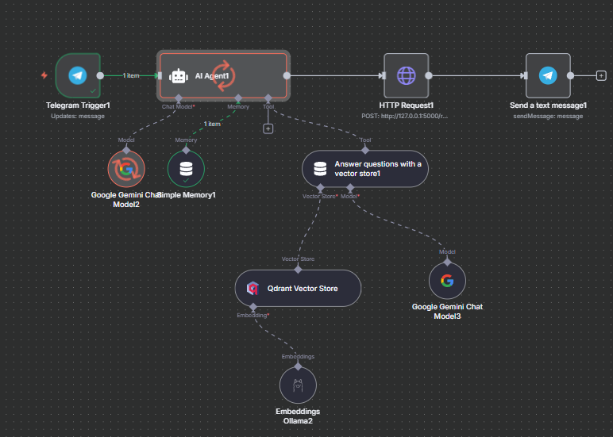
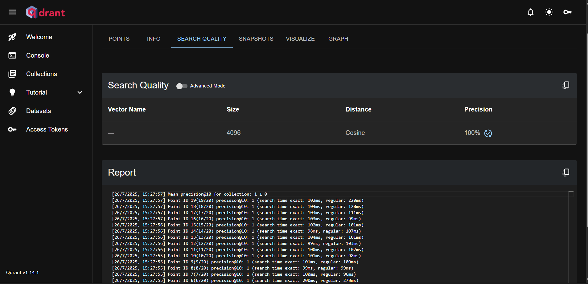
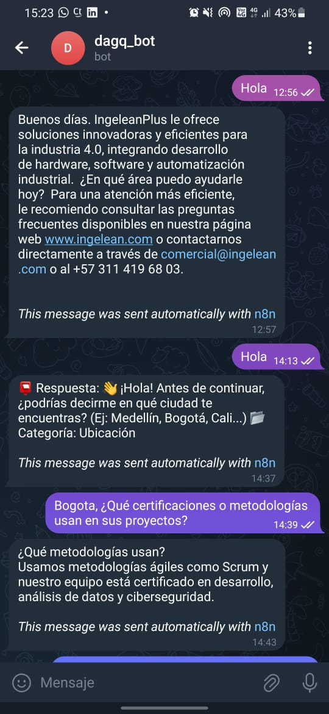

# 1. Identificar problema  
Problema real detectado: 

Ingelean SAS ofrece soluciones altamente técnicas (automatización, hardware, software, tarjetas NFC), pero no cuenta con un sistema automático que atienda preguntas frecuentes. 

Los clientes deben buscar la información en el brochure o comunicarse directamente, lo que representa fricción. 

No hay ningún asistente virtual en su web ni canal de respuesta rápida. 

# Oportunidad: 

 
- Un chatboot nos permitirá: 

- Informar rápidamente a prospectos sobre los servicios, actividades y zonas de cobertura. 

- Reducir la carga operativa del equipo comercial. 

- Aumentar el alcance nacional e internacional con disponibilidad 24/7. 

# 2. Recolección de datos 

# Fuente principal: Brochure oficial (PDF proporcionado) 

# Categorías extraídas directamente del documento: 

# Servicios ofrecidos: 

- Automatización industrial 

-  Desarrollo de hardware 

- Desarrollo de software 

- Automatización de parqueaderos 

- Tarjetas NFC 

- Actividades específicas de cada servicio 

- Alcance geográfico: Colombia (8 departamentos), España y Paraguay 

- Información de contacto y canales oficiales 

- Caso de éxito real (tarjeta electrónica con SCADA y sensores externos) 

🏢 Sobre la empresa y contacto
¿Qué servicios ofrece Ingelean S.A.S.?

¿Cómo puedo comunicarme con su equipo comercial o técnico?

¿Ofrecen servicios en mi ciudad o país?

¿Tienen casos de éxito o proyectos destacados que puedan mostrar?

💻 Desarrollo de software
¿Desarrollan software personalizado para empresas?

¿Qué tipo de software empresarial pueden desarrollar?

¿Puedo integrar sus soluciones con mis sistemas actuales?

¿Ingelean trabaja con visión por computador y machine learning?

🔌 Desarrollo de hardware
¿Diseñan y fabrican hardware electrónico a medida?

¿Pueden desarrollar sistemas embebidos para mi proyecto?

¿Qué experiencia tienen en integración de hardware y software?

⚙️ Automatización industrial
¿Qué tipo de soluciones de automatización industrial brindan?

¿Pueden automatizar procesos específicos de mi empresa?

¿Cuál es el proceso para comenzar un proyecto con ustedes?

¿Cuánto tiempo tarda un proyecto típico en completarse?

📶 Tarjetas y tecnologías NFC
¿Qué son las tarjetas NFC que ofrecen y para qué sirven?

📋 Gestión de proyectos y metodologías
¿Qué certificaciones o metodologías usan en sus proyectos?

¿Cómo puedo solicitar una cotización para un proyecto?

🧠 Preguntas y respuestas frecuentes
🏢 Sobre la empresa y contacto
💬 Usuario: Hola, ¿Qué servicios ofrece Ingelean S.A.S.?
🤖 Chatbot: Ofrecemos soluciones integrales en automatización industrial, desarrollo de software a la medida, diseño y fabricación de hardware electrónico, sistemas embebidos, visión por computador, machine learning y tarjetas NFC.

💬 Usuario: ¿Cómo puedo comunicarme con su equipo comercial o técnico?
🤖 Chatbot: Puedes escribirnos al correo: comercial@ingelean.com o al WhatsApp: +57 311 419 6803. También estamos en redes sociales como @inge.lean.

💬 Usuario: ¿Ofrecen servicios en mi ciudad o país?
🤖 Chatbot: Sí, contamos con cobertura en Colombia (Pereira, Bogotá, Medellín, Cali, entre otras), y también atendemos proyectos en España y Paraguay.

💬 Usuario: ¿Tienen casos de éxito o proyectos destacados que puedan mostrar?
🤖 Chatbot: Sí, por ejemplo, desarrollamos una tarjeta electrónica conectada a un computador industrial que mejoró la productividad entre un 30% y 43%. Podemos compartir más ejemplos si estás interesado.

💻 Desarrollo de software
💬 Usuario: ¿Desarrollan software personalizado para empresas?
🤖 Chatbot: Sí, desarrollamos software a la medida que se adapta 100% a las necesidades de tu empresa, desde sistemas empresariales hasta soluciones en la nube o móviles.

💬 Usuario: ¿Qué tipo de software empresarial pueden desarrollar?
🤖 Chatbot: Creamos sistemas de control, análisis de datos, aplicaciones en la nube, firmware, y más. Todo completamente integrado con tus sistemas actuales.

💬 Usuario: ¿Puedo integrar sus soluciones con mis sistemas actuales?
🤖 Chatbot: Sí, nuestros desarrollos están pensados para ser compatibles e integrables con tus plataformas existentes.

💬 Usuario: ¿Ingelean trabaja con visión por computador y machine learning?
🤖 Chatbot: Sí, desarrollamos soluciones avanzadas con visión artificial, detección de objetos y patrones mediante inteligencia artificial y aprendizaje automático.

🔌 Desarrollo de hardware
💬 Usuario: ¿Diseñan y fabrican hardware electrónico a medida?
🤖 Chatbot: Sí, diseñamos y fabricamos placas electrónicas (PCBs), circuitos analógicos/digitales, y sistemas electrónicos personalizados según tus requerimientos.

💬 Usuario: ¿Pueden desarrollar sistemas embebidos para mi proyecto?
🤖 Chatbot: Claro, trabajamos con sistemas embebidos, programación de microcontroladores y dispositivos inteligentes para diferentes aplicaciones industriales.

💬 Usuario: ¿Qué experiencia tienen en integración de hardware y software?
🤖 Chatbot: Somos expertos en crear soluciones donde el software se comunica eficientemente con el hardware. Esto incluye integración de sensores, actuadores y controladores industriales.

⚙️ Automatización industrial
💬 Usuario: ¿Qué tipo de soluciones de automatización industrial brindan?
🤖 Chatbot: Automatizamos procesos industriales usando PLCs, robots, sensores, sistemas SCADA, control de ejes y más. Todo con el fin de mejorar la eficiencia y seguridad de tus procesos.

💬 Usuario: ¿Pueden automatizar procesos específicos de mi empresa?
🤖 Chatbot: Sí, realizamos diagnósticos, diseñamos mejoras, simulamos procesos y desarrollamos soluciones adaptadas a tus necesidades.

💬 Usuario: ¿Cuál es el proceso para comenzar un proyecto con ustedes?
🤖 Chatbot: Primero hacemos un diagnóstico o reunión de requerimientos, luego diseñamos la solución y presentamos una propuesta detallada para iniciar.

💬 Usuario: ¿Cuánto tiempo tarda un proyecto típico en completarse?
🤖 Chatbot: Depende del alcance del proyecto, pero te damos un cronograma claro desde el inicio. Trabajamos con metodologías ágiles para garantizar entregas rápidas y funcionales.

📶 Tarjetas y tecnologías NFC
💬 Usuario: ¿Qué son las tarjetas NFC que ofrecen y para qué sirven?
🤖 Chatbot: Son tarjetas que permiten la transferencia de datos entre dispositivos por proximidad. Se usan en control de acceso, identificación y más. También incluyen códigos QR para visualizar datos digitales.

📋 Gestión de proyectos y metodologías
💬 Usuario: ¿Qué certificaciones o metodologías usan en sus proyectos?
🤖 Chatbot: Trabajamos con metodologías ágiles como Scrum, y nuestro equipo tiene certificaciones en desarrollo, análisis de datos y ciberseguridad.

💬 Usuario: ¿Cómo puedo solicitar una cotización para un proyecto?
🤖 Chatbot: Escríbenos a comercial@ingelean.com o llena el formulario en nuestro sitio web www.ingelean.com. Te responderemos en el menor tiempo posible.

# 4. Ingeniería de modelos  

Se define una arquitectura basada en recuperación semántica y generación contextual. Se construye una base de preguntas frecuentes con contenido técnico extraído del brochure institucional, estructurado en un formato estándar para consulta automatizada. 
Las preguntas y respuestas se vectorizan para ser almacenadas en un motor de búsqueda semántica. Cuando el usuario realiza una consulta, el sistema evalúa la similitud con el contenido existente. Si no se encuentra un resultado confiable, se realiza una inferencia con un modelo de lenguaje local, capaz de generar respuestas contextualizadas con base en la información empresarial previamente cargada. 
Toda la orquestación del flujo conversacional se implementa mediante un sistema de automatización que permite conectar las distintas fuentes, validar resultados y enviar respuestas de manera eficiente. 

# Qué hace este flujo?
Este chatbot de Telegram conecta con un agente de inteligencia artificial que puede:

Leer lo que escribe el usuario en Telegram.

Detectar la intención y tono emocional del mensaje (por ejemplo: enojo, duda, urgencia, alegría).

Usar IA (Google Gemini) con memoria conversacional para responder con empatía y contexto.

Si necesita más información, consulta una base de conocimiento vectorial (Qdrant) para dar respuestas más precisas (como una FAQ inteligente).

La respuesta se envía nuevamente al usuario por Telegram.

¿Cómo detecta las emociones?
Aunque no se ve directamente en los nodos de la imagen, el modelo de lenguaje (Google Gemini) está diseñado para:

Analizar tono y palabras clave del usuario.

Detectar emociones como:

😠 Frustración → puede responder más empáticamente.

🤔 Duda → puede responder con más claridad o detalles.

😃 Alegría → puede responder con entusiasmo.

Adaptar la forma y tono de la respuesta para que sea emocionalmente coherente.

Ejemplo: si el usuario dice “esto no funciona”, el bot podría responder:
“Lamento que estés teniendo inconvenientes 😟. Déjame ayudarte con eso paso a paso…”

# 5. Evaluación del modelo
El proceso de evaluación se lleva a cabo mediante la validación manual de consultas diseñadas para simular interacciones reales. Se analizan variables como la precisión de la respuesta, la cobertura temática, el tiempo de respuesta y la capacidad del sistema para manejar preguntas fuera de contexto. 
Se documentan los resultados obtenidos con el fin de identificar oportunidades de mejora, ajustar los umbrales de similitud y perfeccionar las instrucciones del modelo de lenguaje. La validación incluye revisiones cruzadas por parte de usuarios técnicos y no técnicos, lo que permite evaluar la utilidad práctica del sistema en distintos niveles de interacción.
la idea es que cualquier pregunta que tengamos la podamos implementar y poder contar con las zonas de consulta ya sea para ampliar nuestra empresa a nuevos sitios y ayudando a la sociedad segun sean sus requerimientos.

Estamos usando una base de conocimiento vectorial llamada Qdrant, que nos permite buscar respuestas similares a lo que el usuario pregunta. En esta prueba, Qdrant evaluó sus resultados y nos muestra que está respondiendo con 100% de precisión y en tiempos muy rápidos (menos de 200 ms por búsqueda). Esto significa que nuestras respuestas basadas en IA son precisas y en tiempo real

# 6. Despliegue
La solución se implementa en un entorno automatizado accesible mediante canales digitales como plataformas de mensajería o el sitio web corporativo. Se configura un servidor intermedio encargado de recibir las consultas, procesarlas, interactuar con los servicios de búsqueda y generación de texto, y entregar la respuesta al usuario en tiempo real. 
El sistema se instala con las dependencias necesarias, garantizando que los modelos y bases de datos se encuentren operativos en todo momento. Se habilitan logs para monitoreo, se documentan las rutas de operación y se establecen mecanismos para realizar actualizaciones sin afectar la disponibilidad del servicio.

# 7. Mantenimiento y actualización

Se plantea un esquema de mantenimiento basado en ciclos de revisión periódica. El objetivo es identificar nuevas necesidades de información, actualizar la base de conocimientos y ajustar el comportamiento del modelo ante cambios en los servicios de la empresa. 
Se realiza seguimiento continuo a las métricas de interacción y se implementan mecanismos para registrar consultas que no hayan sido respondidas correctamente. 
La base de datos semántica se actualiza cuando se detectan nuevas temáticas recurrentes, mientras que el modelo generativo se afina con nuevos ejemplos representativos. También se contempla la posibilidad de ampliar los canales de atención conforme se validen los resultados en producción.

